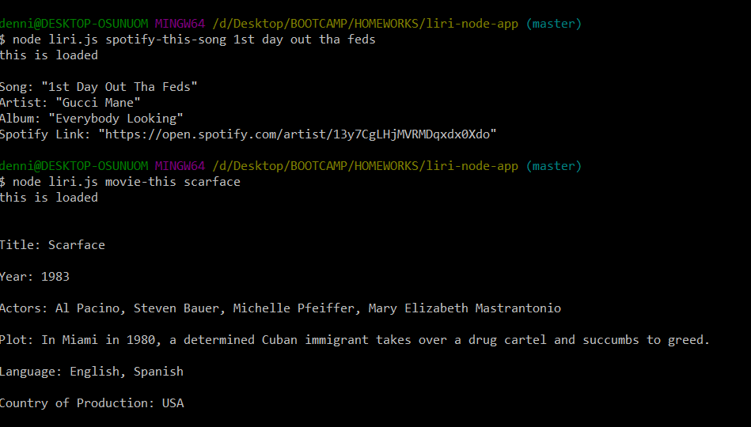

# Node.JS Language Interpretation App

 [View Live!](https://bereznd1.github.io/Language-Interpretation-App/liri.js) 

## Brief Description

The **Node.JS Language Interpretation App** (or **LIRI** - Language Interpretation and Recognition Interface) uses **Node.JS**, plus the NPM packages **Twitter**, **Node-Spotify-API**, **Request**, & **DotEnv**, to create a command line node app that takes in users' commands and displays data for them based on what they entered. The app allows users to retrieve the latest 20 tweets from a predefined Twitter account, to search for information on a specific song using the Spotify API, to search for information on a specific film using the **OMDB API**, and to run the "spotify song" feature using the info found in a local text file.

## How This Was Achieved
First, I "required" all the necessary NPM packages, plus the file that stores my API keys. I also used the **DotEnv** package to read and set any environment variables to the global process.env object in node, so as not to upload my real API Key information to Github (in order to keep it private). I then set up variables to store any command that the user may type in (by referencing the **process.argv** array). These commands include: 

* **"my-tweets"** - retrieves latest 20 tweets from a predefined Twitter account
* **"spotify-this-song [song title]"** - searches the Spotify database for the song that the user entered and displays information about that song
* **"movie-this [movie title]"** - searches the OMDB database for the movie that the user entered and displays information about that movie
* **"do-what-it-says"** - run the "spotify-this-song" command using the info found in a local text file

I created **if-else statements** that evaluate which command was typed in, and use that information to know which task to run. For the Twitter command, if the predefined account has less than 20 tweets, the interface will display all of its tweets. For the Spotify command, if no song title is specified, the interface will display info on the default track "The Sign" by Ace of Base. For the movie command, if no movie title is specified, the interface will display info on the default film "Mr. Nobody". The last command, **do-what-it-says**, uses the **fs** package to read a local text file and create an array based on the text within it. This enables the code to reference one of the array items and plug it into the URL that is called during the Spotify API request. 

If the user doesn't type in any command when opening up the app in node, some predefined intro text will be displayed to inform of the command options they have.